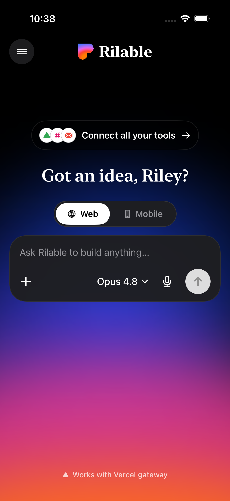
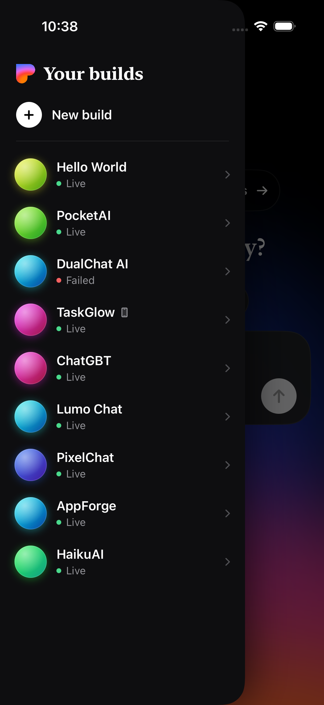
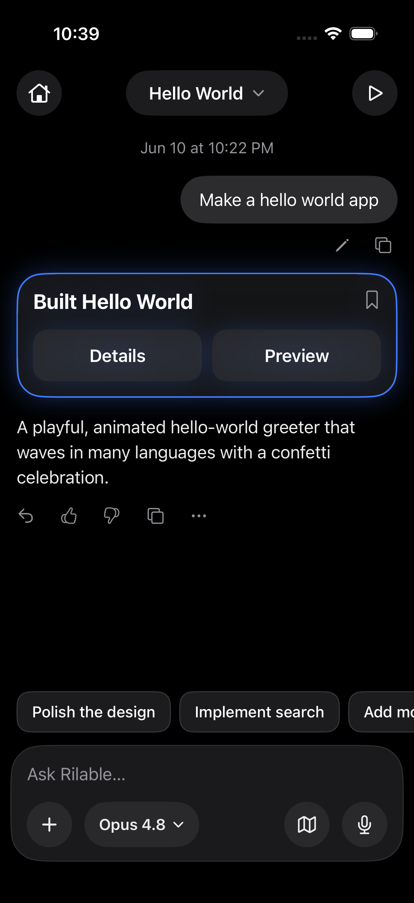

# Rilable

**An open-source iPhone app that builds apps.** Type a prompt → an AI agent writes the code →
it goes live in the cloud → you preview it right inside the app. Web apps run in
[Daytona](https://daytona.io) sandboxes; native iOS apps are compiled by
[Chorus](https://ios.chorus.com) cloud Xcode and previewed in a browser iPhone simulator — or
installed on your real phone via an OTA link the agent drops in chat.

Built with SwiftUI + [Convex](https://convex.dev) + Claude. No auth, no waitlist — it's your
own stack, your own keys.

| | | |
|---|---|---|
|  |  |  |

## The fastest way to set it up

Give this repo to [Claude Code](https://claude.com/claude-code) (or any capable coding agent)
and say:

> Clone https://github.com/rbrown101010/rilable and set it up for me.

[`CLAUDE.md`](CLAUDE.md) is written for the agent: it walks through creating the free Convex
backend, collecting each API key (with exact URLs), configuring the iOS app, building it, and
verifying an end-to-end build — asking you only for the keys.

Prefer to do it by hand? `CLAUDE.md` reads just as well for humans.

## What it does

- **Web | Mobile toggle** — web prompts become polished static web apps served from a public
  Daytona sandbox; mobile prompts become real SwiftUI apps compiled in the cloud
- **Live agent chat** — build status streams in real time (Convex subscriptions); follow-up
  messages edit the app; compile errors on mobile builds are auto-repaired by the agent
- **In-app preview** — web apps render in a WKWebView; iOS apps stream from a cloud iPhone
  simulator, with reload / open-in-Safari / share
- **Install on your iPhone** — ask the chat for "the download link" and the agent signs the
  build (ad-hoc, via your Apple account connected to Chorus) and posts an OTA install link
- **Model picker** — per-project Claude model (plus a "Fable 5" easter egg that's secretly
  Opus 4.8)
- **Voice input** — mic in every composer, transcribed by Whisper (key stays server-side)
- **AI skill for generated apps** — a keyless proxy to the Vercel AI Gateway means every app
  the agent builds can have AI features without leaking your key into client code

## Keys you'll need

Anthropic (required) · Daytona (web builds) · Chorus (mobile builds) · OpenAI (voice,
optional) · Vercel AI Gateway (AI-powered generated apps, optional). All keys live as Convex
env vars on **your** deployment — none are committed, and generated apps never contain them.

## Honest caveats

- The Convex functions are unauthenticated by design (single-user app) — anyone with your
  deployment URL could create builds on your accounts. Keep the URL to yourself or add auth.
- The `/ai/*` gateway proxy is public for the same reason; rotate your `vck_` key if needed.
- Web preview URLs are public links (that's what makes sharing work).
- The UI is a loving clone of Lovable's mobile app for personal use — if you ship this
  somewhere serious, re-skin it.

## License

MIT — see [LICENSE](LICENSE).
